# doks-vcluster-challenge

Aroused by https://www.digitalocean.com/community/pages/kubernetes-challenge to give `vcluster` a shot.

## k8s Cluster Upgrade Challenge
> Install vcluster to test upgrades (eg. 1.20 to 1.21 DOKS version) of your cluster. With a virtual cluster, you can create a new Kubernetes cluster inside your existing DOKS cluster, test the application in this new vcluster, and then upgrade your original cluster if everything works well with the new version. 

In this challenge exercise, the background is designed that the real cluster DOKS (in v1.20.11) has a `httpbin` backend application up and running, and we are going to use vcluster to make sure the cluster upgrade (v1.20.11 -> v1.21.5) won't incur any unexpected regression.


## DOKS
Let's create a DOKS with v1.20:
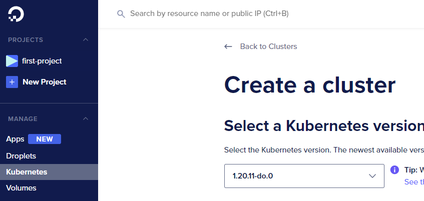

## Install vcluster CLI (locally)
Once the DOKS is ready and the `kubectl` CLI is configured properly, we are ready to go. 

First thing first, we have to download and install the `vcluster` CLI locally by following the [docs](https://www.vcluster.com/docs/getting-started/setup#download-vcluster-cli). 


## Deploy
All set. Let's create a new vcluster called `team-1` in namespace `ns-1` 
```bash
$ vcluster create team-1 -n ns-1
[fatal]  seems like helm is not installed. Helm is required for the creation of a virtual cluster. Please visit https://helm.sh/docs/intro/install/ for install instructions
```
Aha, the docs didn't mention this pre-requisite. But it's alright, we can manage it.
A few seconds later, `helm` CLI is installed 👌. Let's retry.

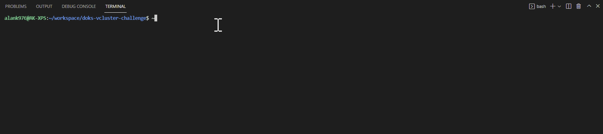

As it's literal meaning, vcluster seemingly uses helm under the hood to make all magics happen. Let's sneak in a bit what are applied from the chart.

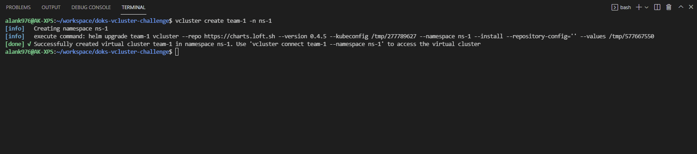

```bash
$ helm -n ns-1 get manifest team-1 | grep Source
# Source: vcluster/templates/serviceaccount.yaml
# Source: vcluster/templates/rbac/role.yaml
# Source: vcluster/templates/rbac/rolebinding.yaml
# Source: vcluster/templates/service.yaml
# Source: vcluster/templates/statefulset-service.yaml
# Source: vcluster/templates/statefulset.yaml
```
Surprisingly, vcluster works with just a few manifests. No wonder it's advertised [No Admin Privileges Required](https://www.vcluster.com/docs/architecture/basics#5-no-admin-privileges-required):
>  If a user has the RBAC permissions to deploy a simple web application to a namespace, they should also be able to deploy vclusters to this namespace.

## Use the created vcluster
As suggested, running the connect command and start port-forwarding.

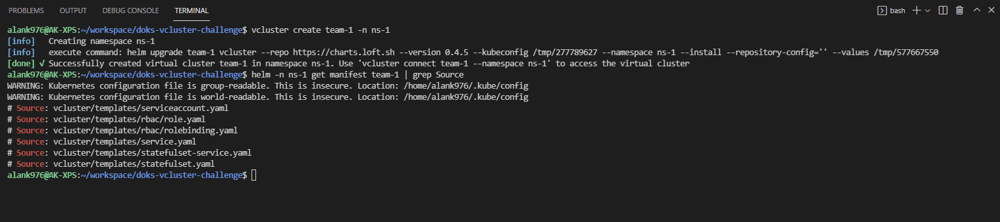

So, from now on, we can run `kubectl --kubeconfig ./kubeconfig.yaml <sub-command>` against this virtual cluster without knowing whether it's real. Carrying the `--kubeconfig` maybe a bit lame but let's stick with it for now, since it helps us differentiate which cluster we will be targetting to.

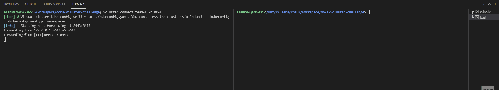

It does look like a brand new cluster. But wait, what's the vcluster version?

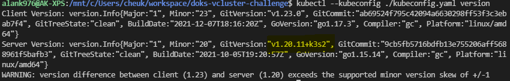

I feel like vcluster is smart enough to pick the same version of the underlying cluster as (1.20.11) for its k3s. That's a great set up and we are going to upgrade this vcluster as a guinea pig.

## Deploy apps and test k8s Service in real cluster
Let's simulate the real cluster has an application running.
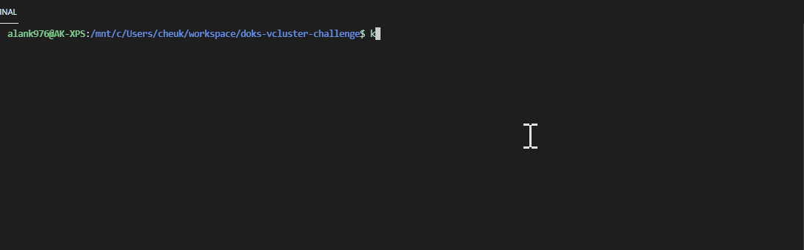

Using a curl job to make sure it's working okay:
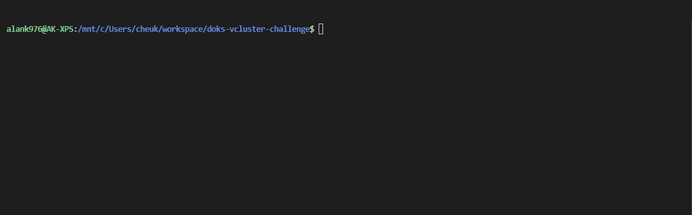

### Deploy apps in vcluster with v1.20.11
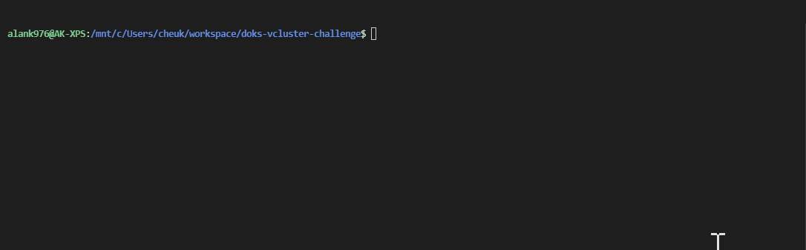


### How syncer works
Alright. But then, how's the real cluster looks like?
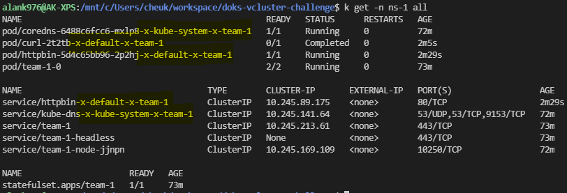
As we can see, both server and pod are appended `x-<inner-namespace>-x-<vcluster-name>` suffix. vcluster uses **syncer** to mimic the workloads are logically in a virtual cluster according to its documentation.

### Within vcluster traffic
We have already seen how the curl job reaches the httpbin within the vcluster. vcluster has it documented how it's achieved by having another DNS service in the vcluster instead of talking to the "outer" DNS service directly in the real cluster.

On the other hand, we saw `service/httpbin-x-default-x-team-1` in the real cluster. My curiosity drives me to try the same from the real cluster, to this service.
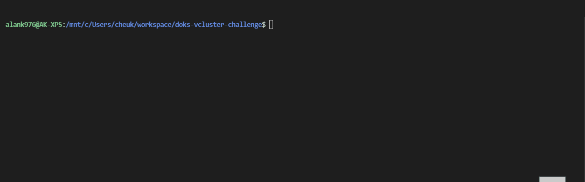

It works. The lowest-level stuffs like pod and service "physically" exist in the real cluster and what vcluster does is just sync or we can take it as "sym-link" I believe.

## Upgrade vcluster (k3s) to target DOKS upgradable version (v1.21.5)
Apologies for sidetracking to syncer stuff. Let's focus on cluster upgrade now. To do so, vcluster CLI allows us to upgrade the cluster by specifying image tag of the k3s.
According to [Dockerhub](https://hub.docker.com/r/rancher/k3s/tags?page=1&name=1.21.5), `v1.21.5-k3s2` will be used.
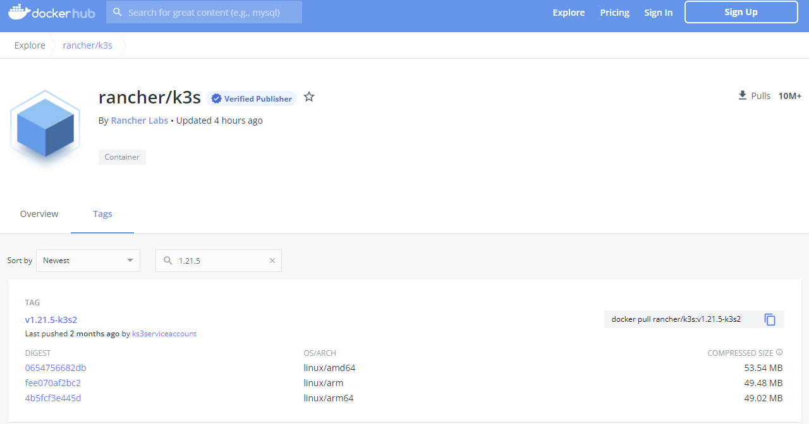

I would love to also give `--expose` a try because I am tired of port-forwarding holding one of my consoles. So we are going to run this command:
```bash
vcluster create team-1 \
  -n ns-1 \
  --upgrade \
  --k3s-image rancher/k3s:v1.21.5-k3s2 \
  --expose
```
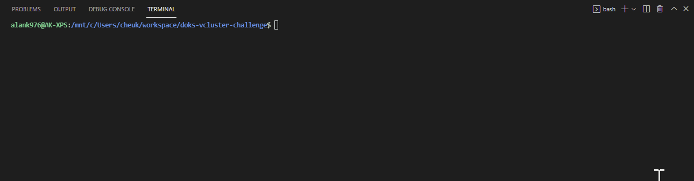
The generated kubeconfig.yaml would be automatically updated as well. 
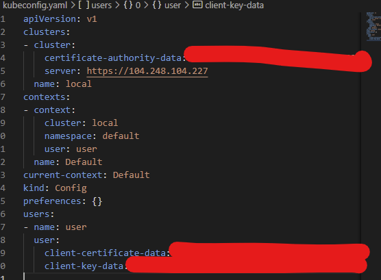

Now, the vcluster should be with version 1.21.5.
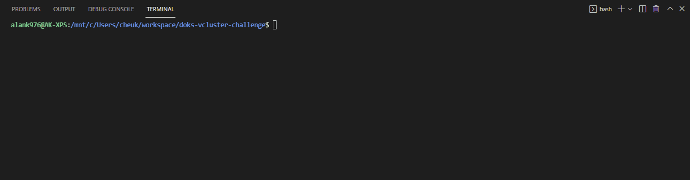

Alright, let's test if the httpbin still works after cluster upgrade. 
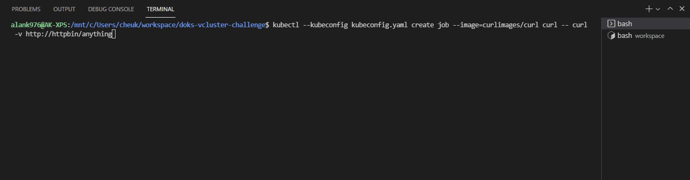

## Upgrade DOKS to 1.21.5
Hurray! vcluster proves 1.21.5 works for us. Let's upgrade DOKS! 
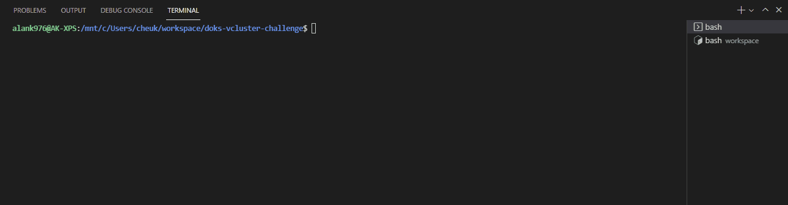
After a while, new k8s nodes for the new version of cluster are created. 
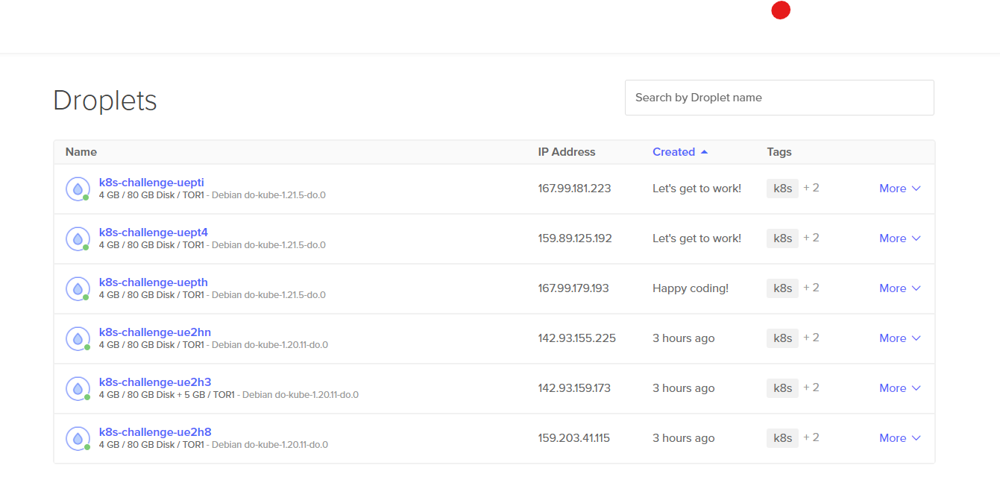
Now, let's update the kubeconfig file in case the URL is changed, then we will also verify the cluster version.

## Verify if the httpbin backend is still working fine


## Cleanup
Last but not least, cleanup is as easy as:
```bash
vcluster delete team-1 -n ns-1
```
